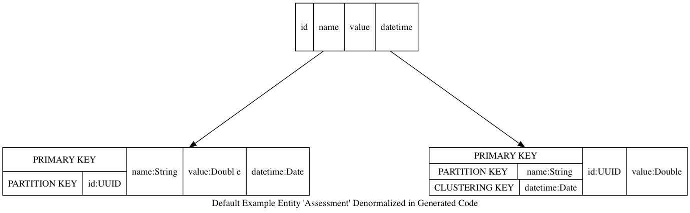

[](https://www.codacy.com/app/navicore/akka-http-phantom.g8?utm_source=github.com&amp;utm_medium=referral&amp;utm_content=navicore/akka-http-phantom.g8&amp;utm_campaign=Badge_Grade)
[](https://travis-ci.org/navicore/akka-http-phantom.g8)

A [g8] Template for an Akka HTTP API Server persisting objects with [Phantom] for [Cassandra]
---

## PREREQ

  * sbt >= 13.16

## USAGE

G8 will prompt you for details like your project name and package name

In a terminal shell, enter:

```console
sbt new navicore/akka-http-phantom.g8 
```

`cd` into the resulting directory and `sbt run`

See generated the README.md for how to build, configure, and connect to Cassandra

#### Notes About The Generated Example

* The initial example entity is stored denormalized
* primary key for one model is a v4 UUID
* primary key for a second model is `name` and clustering key is `datetime`
* CRUD works - see generated examples dir
* basic time series lookups (last 'n' occurrences of 'name')
* could be modified to be an append-only event-sourcing backend



[Phantom]: https://github.com/outworkers/phantom
[Cassandra]: http://cassandra.apache.org/
[g8]: http://www.foundweekends.org/giter8/
[g8 setup]: http://www.foundweekends.org/giter8/setup.html 


## DEVELOPING

While changing the template, test using something like:

```console
sbt new file:///Users/navicore/git/navicore/akka-http-phantom.g8
```

